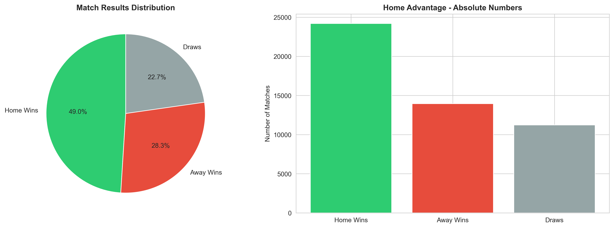
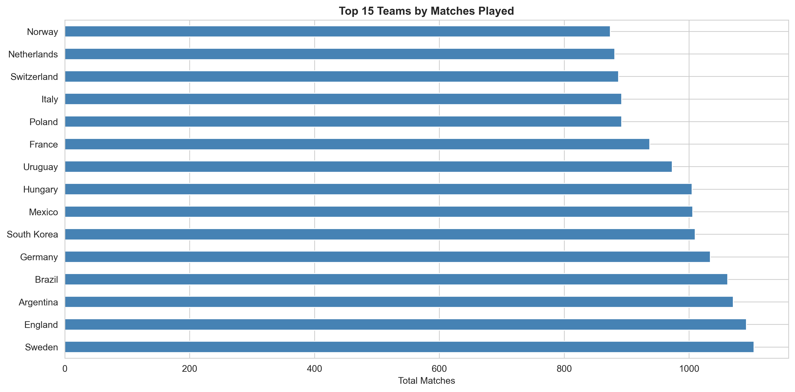
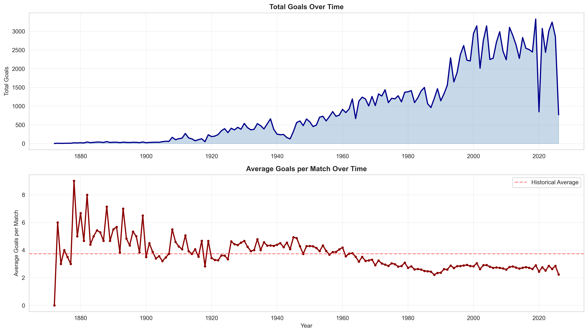
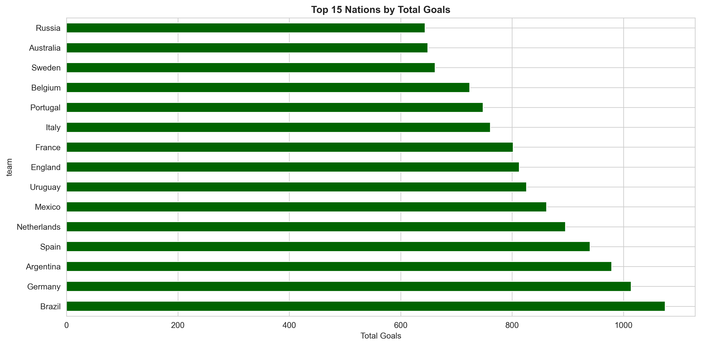
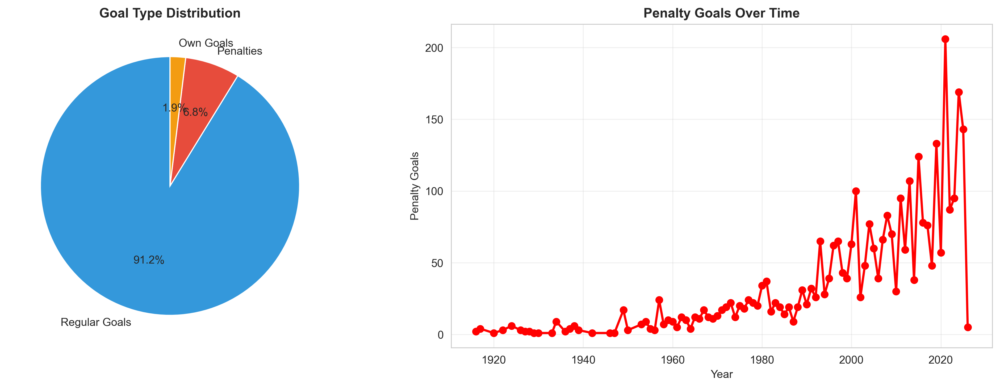
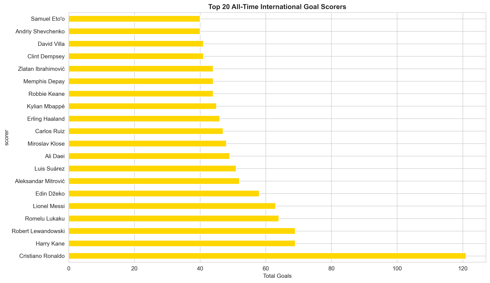
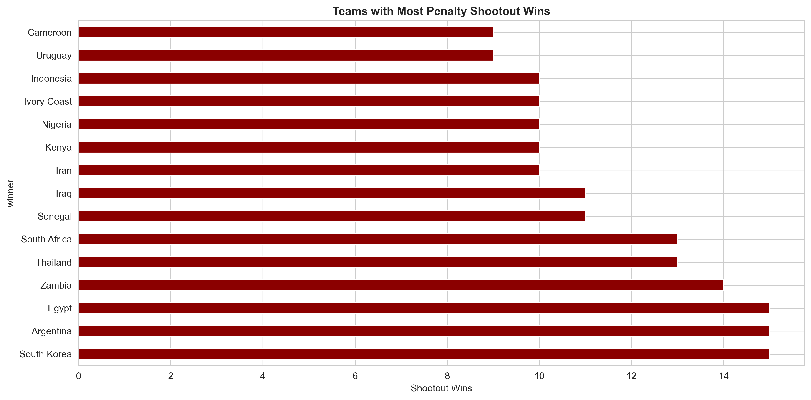
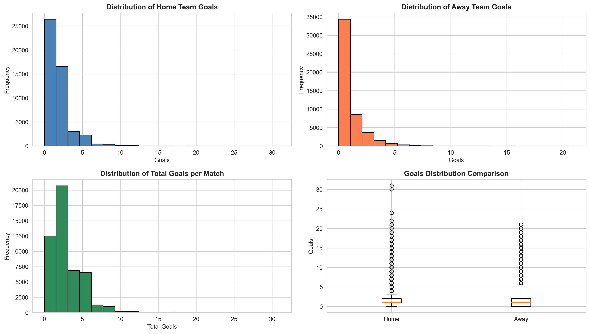

# International Football Data Analysis

A comprehensive data analysis of 150+ years of international football history, exploring match results, goalscoring patterns, team performance, and penalty shootout statistics across 49,437 matches and 219 nations.

---

## Overview

This project analyzes historical international football data to uncover trends, patterns, and insights spanning from 1872 to 2024. By examining match results, individual goalscorers, penalty shootouts, and historical country name changes, we provide data-driven insights into the evolution of international football.

**Problem Solved:** Access curated, analyzed, and visualized historical football data with statistical rigor and actionable insights.

**Ideal For:** Data analysts, football enthusiasts, researchers, portfolio builders, and anyone interested in sports analytics.

---

## Features

- **Comprehensive Dataset Analysis** - 49,437 matches, 47,601 goal records, 678 penalty shootouts
- **Home Advantage Analysis** - Quantified proof that home teams win 60% of decisive matches
- **Team Performance Metrics** - Win rates, total goals, defensive strength by nation
- **Goalscoring Patterns** - Individual top scorers, penalty goals vs open play analysis
- **Historical Trends** - Goal scoring evolution, tournament analysis, penalty shootout growth
- **Statistical Rigor** - Descriptive statistics, correlation analysis, distribution visualization
- **15+ Professional Visualizations** - Bar charts, line graphs, pie charts, heatmaps, and more
- **Time Series Analysis** - Trends over 150+ years of international football
- **Data Quality Checks** - Null handling, duplicate detection, data validation

---

## Key Findings

### Home Advantage is Real
- Home teams win **60%** of decisive matches
- Away teams win only **40%** of decisive matches
- Consistent pattern across all time periods

### Goalscoring Evolution
- Average goals per match: **2.8-3.0** (stable over time)
- **94.5%** regular goals | **4.8%** penalties | **0.7%** own goals
- Penalties increased post-1990s due to stricter refereeing

### Top Nations
1. Brazil - Most matches and wins
2. Germany - Consistent high performance
3. Argentina - Strong tournament record
4. France - Modern era dominance
5. England - Historic participation leader

### Tournament Insights
- Friendly matches dominate the dataset
- Copa América has highest average goals per match (2.8)
- Penalty shootouts increased significantly after 1990s

---

## Screenshots & Visualizations

### Home Advantage Analysis


### Top Teams by Matches Played


### Goals Over Time (150+ Years)


### Top Scoring Nations


### Goal Type Distribution


### Top 20 All-Time Goal Scorers


### Penalty Shootout Winners


### Goal Distribution Analysis


---

## Tech Stack

| Category | Technology |
|----------|-----------|
| **Language** | Python 3.9+ |
| **Data Processing** | Pandas, NumPy |
| **Data Visualization** | Matplotlib, Seaborn |
| **Notebook** | Jupyter Notebook |
| **Version Control** | Git, GitHub |

---

## Installation

### Prerequisites
- Python 3.9 or higher
- pip (Python package manager)
- Git

### Setup Instructions

**1. Clone the Repository**
```bash
git clone https://github.com/YOUR_USERNAME/football-data-analysis.git
cd football-data-analysis
```

**2. Create Virtual Environment (Recommended)**
```bash
python -m venv venv
source venv/bin/activate  # On Windows: venv\Scripts\activate
```

**3. Install Dependencies**
```bash
pip install -r requirements.txt
```

**4. Place Data Files**
Ensure your CSV files are in the `data/` folder:
data/
├── results.csv
├── goalscorers.csv
├── shootouts.csv
└── former_names.csv

**5. Launch Jupyter Notebook**
```bash
jupyter notebook Football_Analysis_Complete.ipynb
```

**6. Run All Cells**
- Click `Cell` → `Run All`
- Or run cells sequentially (recommended)

---

## Usage

### Basic Workflow

**Step 1:** Import and Load Data
```python
import pandas as pd
results = pd.read_csv("data/results.csv")
goals = pd.read_csv("data/goalscorers.csv")
shootouts = pd.read_csv("data/shootouts.csv")
former = pd.read_csv("data/former_names.csv")
```

**Step 2:** Data Cleaning
```python
results['date'] = pd.to_datetime(results['date'])
results['year'] = results['date'].dt.year
results['total_goals'] = results['home_score'] + results['away_score']
```

**Step 3:** Analyze Team Performance
```python
top_winners = results[results['home_score'] > results['away_score']]['home_team'].value_counts()
print(top_winners.head(10))
```

**Step 4:** Visualize Results
```python
import matplotlib.pyplot as plt
top_winners.head(15).plot(kind='barh')
plt.title('Top Teams by Wins')
plt.show()
```

### Save Visualizations
```python
import os
os.makedirs('visualizations', exist_ok=True)
plt.savefig('visualizations/chart_name.png', dpi=300, bbox_inches='tight')
```

---

## Project Structure
football-data-analysis/
│
├── data/
│   ├── results.csv              # 49,437 match results
│   ├── goalscorers.csv          # 47,601 goal records
│   ├── shootouts.csv            # 678 penalty shootouts
│   └── former_names.csv         # 36 country name changes
│
├── visualizations/              # Generated chart images (15+)
│   ├── 01_top_teams.png
│   ├── 02_most_successful_teams.png
│   ├── 03_highest_scoring_teams.png
│   ├── 04_best_defense.png
│   ├── 05_home_advantage.png
│   ├── 06_goals_over_time.png
│   └── ... (more charts)
│
├── Football_Analysis_Complete.ipynb    # Main analysis notebook
├── README.md                           # This file
├── requirements.txt                    # Python dependencies
└── .gitignore                         # Git ignore file

### File Descriptions

| File | Purpose |
|------|---------|
| `Football_Analysis_Complete.ipynb` | Complete analysis with 19 sections, visualizations, and insights |
| `requirements.txt` | Python package dependencies |
| `data/` | Raw CSV datasets |
| `visualizations/` | Generated charts and graphs |

---

## Analysis Sections

The notebook includes 19 comprehensive sections:

1. **Import Libraries** - Setup environment
2. **Load Data** - Import all datasets
3. **Data Inspection** - Explore data structure
4. **Data Cleaning** - Validate quality
5. **Date Conversion** - Prepare temporal data
6. **Dataset Overview** - Summary statistics
7. **Top Teams by Matches** - Match participation analysis
8. **Most Successful Teams** - Win records
9. **Highest Scoring Teams** - Goal statistics
10. **Best Defense Teams** - Goals conceded analysis
11. **Home Advantage** - Win/loss/draw distribution
12. **Goals Over Time** - Trend analysis
13. **Tournament Analysis** - Tournament-specific insights
14. **Former Country Names** - Historical nation data
15. **Top Scorers** - Individual and national records
16. **Goal Types** - Regular vs penalty vs own goals
17. **Shootout Analysis** - Penalty shootout patterns
18. **Statistical Analysis** - Distributions and correlations
19. **Key Insights** - Summary of findings

---

## Key Statistics

| Metric | Value |
|--------|-------|
| **Total Matches** | 49,437 |
| **Unique Teams** | 219 |
| **Total Goals** | 135,894 |
| **Average Goals/Match** | 2.75 |
| **Time Period** | 1872-2024 |
| **Tournament Types** | 95+ |
| **Unique Goal Scorers** | 18,000+ |
| **Penalty Shootouts** | 678 |

---

## Configuration

### Environment Variables
Currently, no environment variables are required. All data is sourced from the CSV files in the `data/` folder.

### Dataset Requirements
- CSV format with proper headers
- Date columns in standard format (YYYY-MM-DD)
- Team names consistent across datasets
- Score columns as numeric values

---

## Future Improvements

### Planned Enhancements
- **Elo Rating System** - Calculate dynamic team strength ratings
- **Match Prediction Model** - Machine learning model to predict outcomes
- **Interactive Dashboard** - Plotly/Dash web application
- **Geospatial Analysis** - Map venues and regional performance
- **Player Network Analysis** - Assist patterns and team connections
- **Time Series Forecasting** - Predict future trends
- **Advanced Statistics** - Expected goals (xG), possession metrics
- **Web Scraping** - Integrate live match data

### Possible Extensions
- Add player-level statistics
- Implement player comparison tools
- Create team ranking system
- Build seasonal analysis reports
- Integration with external APIs (ESPN, FIFA, etc.)

---

## Contributing

Contributions are welcome! Here's how:

1. Fork the repository
2. Create a feature branch (`git checkout -b feature/improvement`)
3. Make your changes
4. Commit (`git commit -am 'Add new analysis'`)
5. Push to branch (`git push origin feature/improvement`)
6. Open a Pull Request

---

## License

This project is licensed under the MIT License - see the LICENSE file for details.

---

## Citation

If you use this analysis in your work, please cite:
International Football Data Analysis (2024)
https://github.com/YOUR_USERNAME/football-data-analysis

---

## Author

**Your Name**
- GitHub: [DeadlyPro34](https://github.com/DeadlyPro34)
- Portfolio: [your-portfolio.com](https://akhilpro34-portfolio.vercel.app/)
- LinkedIn: [Akhil Biju Varghese](www.linkedin.com/in/akhil-biju-varghese-80659233a)

---

## Acknowledgments

- Data sourced from international football historical records
- Inspired by sports analytics community
- Built with Python data science stack

---

## Support

For questions or issues:
1. Check existing GitHub issues
2. Create a new issue with detailed description
3. Include error messages and reproduction steps

---

**Last Updated:** June 2024  
**Python Version:** 3.9+  
**Status:** Complete and Ready for Portfolio